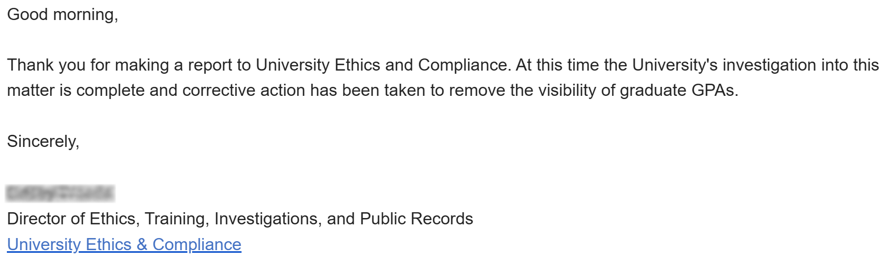
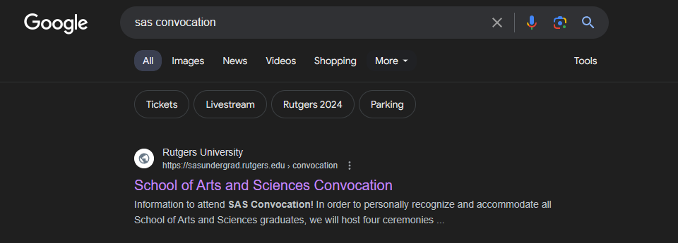
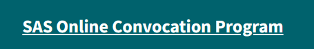
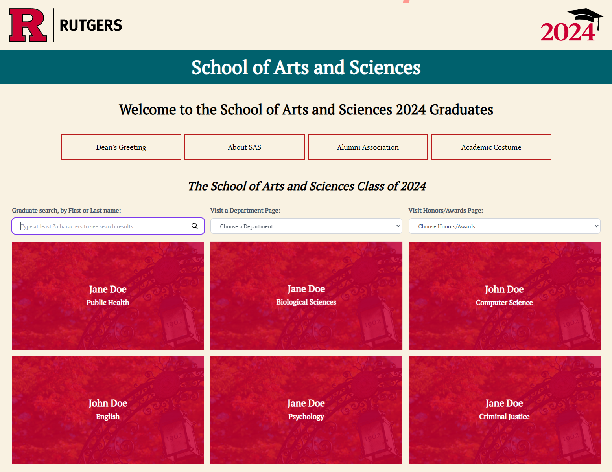
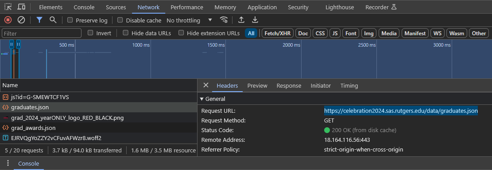
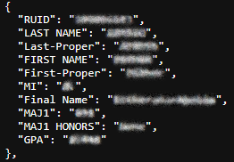
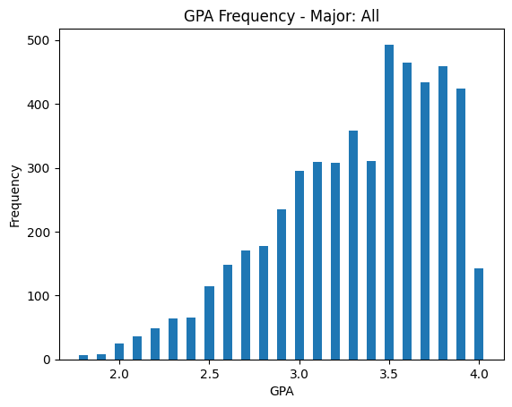
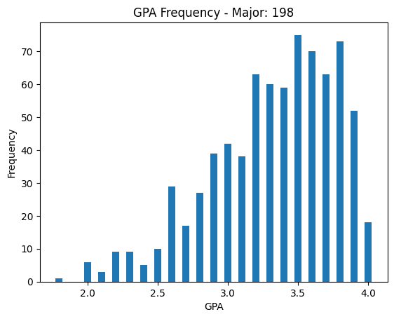

# Class of 2024 GPA Distributions

Recently, while browsing the Rutgers SAS Convocation website for the Class of 2024, I stumbled upon an unexpected discovery. There was a data leak that exposed the Grade Point Averages (GPAs) of each student in the SAS graduating class. This sensitive information, which should have been kept confidential, was inadvertently made available to the public. This exposure likely constitutes a violation of the [Family Educational Rights and Privacy Act (FERPA)](https://www2.ed.gov/policy/gen/guid/fpco/ferpa/index.html), a federal law designed to protect the privacy of student education records. Upon the discovery of this, I promptly filed a formal complaint to the [University's Office of Ethics and Compliance (UEC)](https://uec.rutgers.edu/).

*EDIT (5/23): As of yesterday morning, the UEC resolved the issue. Going to the link below no longer displays students' GPAs.*
|  |
|:--:|
| *A fix was confirmed 5/22 at 9:35 AM.* |

Below, I have written a bit of how I discovered this flaw as well as a section regarding the grade distribution using an anonymized version of the data.

## Discovery

Searching for information about the Rutgers SAS Convocation for the Class of 2024, I came across the official website where details about the graduation ceremony were listed.

|  |
|:--:|
| *https://sasundergrad.rutgers.edu/convocation* |

Looking for the list of graduates, I clicked on the *SAS Online Convocation Program* button (image below) which led me to the page listing all the graduates (third image).

|  |
|:--:|
|  |
| *https://celebration2024.sas.rutgers.edu/?page=1 - Names in the image are anonymized.* |

Curious how all this data was being acquired and stored, I inspected the network requests. Here, I could see the requests being made to the server, and the response data (`graduates.json`) containing the sensitive information.

| |
|:--:|
| *https://celebration2024.sas.rutgers.edu/data/graduates.json* |

Clicking on the highlighted link above, I came across sensitive data of all of the graduating students. This file included the RUID affiliated with each student along with their GPAs (an anonymized example can be seen below). Given the front-end design, the only values needed were the names, majors, and any honors if achieved; however, the exposure of this superfluous information highlights the clear oversight and significant privacy flaw in the website's design.

|  |
|:--:|
| *Anonymized `graduates.json` object* |

## Grade Distribution Analysis

Using the data inadvertently exposed, I conducted an analysis of the GPA distribution for the Rutgers SAS Class of 2024. The data has been anonymized and order randomized to ensure student privacy while still providing a meaningful overview of the academic performance of the class. Additionally, I wrote a script to analyze the GPA distributions by any SAS major.

Here are the distributions for the School of Arts and Sciences (SAS) and Computer Science (198):

|  | 
|:--:|
|  |
